# Real-Time Chat App

A Slack/WhatsApp-style messenger built to answer one question well: **what does it actually take to make chat real-time, horizontally scalable, and honest about its trade-offs?** Project 9 of a 20-project intermediate curriculum.


## The Problem

Chat looks deceptively simple until you try to build it for real. This project attacks the hard parts head-on:

1. **WebSockets need a process that can own them.** Next.js can't host a long-lived socket connection with multi-instance room tracking — so messaging runs on a dedicated Socket.IO server that scales independently of the web app.
2. **One server is a demo; two are an architecture.** The Socket.IO Redis adapter fans every emit out to *all* instances. Two clients connected to two different server processes still receive each other's messages — proven by an integration suite, not a slide.
3. **Presence must self-heal.** Redis TTL keys + heartbeats mean a crashed server's users go offline automatically when their keys expire — zero cleanup code.
4. **Ephemeral data doesn't earn persistence.** Typing indicators are broadcast-only; each client evicts stale typers after 4 s. No key, no row, no regret.
5. **Read receipts can be O(1).** A per-member `lastReadAt` watermark (the Slack/Discord model) instead of a per-message receipt table that grows by `members × messages`.
6. **Ever-growing tables need keyset pagination.** Message history uses `(createdAt, id)` keyset cursors — stable under live appends, unlike the offset pagination most CRUD apps get away with.
7. **Two processes must share one contract.** Every socket payload is a zod schema in `@chat/shared`, imported by both the server and the client. Payload drift is a compile-time (and now CI) problem, not a 2 a.m. incident.

## Features

- 🔐 Email/password auth (NextAuth, JWE sessions) — the session token also authenticates the WebSocket handshake
- 💬 1:1 DMs + group chats with owner-based member management and SYSTEM audit messages in the timeline
- ⚡ Instant delivery across server instances (Redis adapter), optimistic sends with server-ack swap, reconnect gap recovery via `?after=` backfill
- ✍️ Typing indicators (broadcast-only, 4 s client eviction)
- 🟢 Presence: online/offline/last-seen, broadcast **only to users who share a conversation**
- ✓✓ Read receipts + live unread badges (per-device, `document.title` included)
- 📜 Cursor-paginated history, edit (≤15 min), soft-delete tombstones, replies, markdown-lite
- 🖼️ Image + file attachments: upload validation (magic bytes), inline render, lightbox, signed downloads
- 🔔 Browser notifications (gesture-gated, mute-aware)
- 🧪 Two-instance integration suite proving cross-instance fan-out with real Redis + Postgres

## Tech Stack

| Layer | Choice |
| --- | --- |
| Web | Next.js 16 (App Router) + Tailwind CSS v4 |
| Real-time | Node 20 + Socket.IO 4.8 on a dedicated process (`ws/`) |
| Scale | `@socket.io/redis-adapter` — Pub/Sub fan-out between instances |
| Data | PostgreSQL 16 + Prisma 6, Redis 7 (presence TTLs, unread counters, rate limits, Pub/Sub) |
| Auth | NextAuth v4 (Credentials + JWT) — `next-auth/jwt decode()` shared with the WS server |
| Monorepo | npm workspaces: `web` \| `ws` \| `shared` |
| Client state | TanStack Query v5 (socket events are just cache mutations) |
| Validation | Zod everywhere — REST bodies *and* every socket payload |
| Storage | Pluggable: S3 \| Cloudinary \| local (HMAC-signed URLs) |
| Testing | Vitest + socket.io-client (unit + two-instance integration), Testing Library |
| Infra | Docker Compose (dev services + `prod-verify` topology with nginx), GitHub Actions |

## Architecture

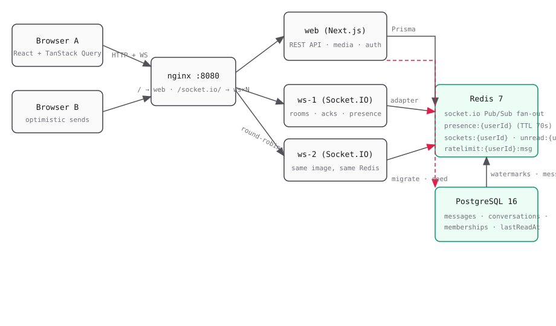

```text
                 ┌────────────┐
   Browser A ───▶│            │──► web (Next.js) ──► PostgreSQL
   Browser B ───▶│   nginx    │          │  ▲
        │        │            │          │  │ /socket.io/ws proxy (+ cookie handshake)
        │        └────┬───────┘          ▼  │
        │              │ round-robin    REST + media
        │              ▼
        │      ┌─────────────────┐
        └─────►│ ws-1   ws-2     │  Socket.IO (rooms, acks, presence, rate limits)
               └───┬─────────┬───┘
                   │  Redis adapter (Pub/Sub fan-out to ALL instances)
                   ▼
                 Redis  ── presence TTL keys · sockets sets · unread hashes ·
                 ▲                rate-limit counters · socket.io Pub/Sub
                 │
             PostgreSQL  ◄── messages, memberships, watermarks (the truth)
```

**Send-a-message happy path** (`message:send` → ack):

1. zod-validate payload (shared schema) → ack `422` on failure
2. membership re-check in Postgres (rooms are a routing cache, never an auth check) → `NOT_FOUND`
3. Redis rate limit (`INCR`, 30 msgs / 10 s) → ack `429`
4. Prisma insert (unique `clientId` dedupes a reconnect double-send) + `lastMessageAt` bump
5. Redis pipeline `HINCRBY unread:{member}` for every other member
6. `io.to("conversation:{id}").emit("message:new")` → **adapter relays to all instances**
7. `io.to("user:{memberId}").emit("unread:update")` → badge on every device
8. ack with the persisted row → client swaps its optimistic bubble

## Data Model

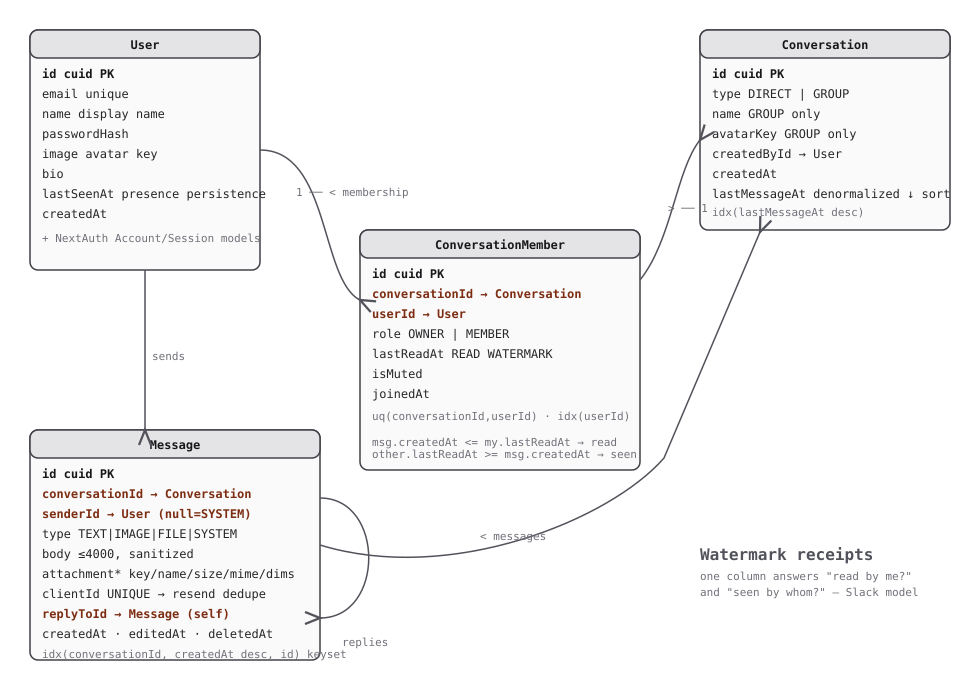

Key decisions:

- **Read receipts = `lastReadAt` watermark** on `ConversationMember`. *Have I read this?* → `msg.createdAt <= my.lastReadAt`. *Who has seen my message?* → `other.lastReadAt >= msg.createdAt`. One indexed column answers both.
- **DM uniqueness via a Postgres advisory lock.** No relational constraint can express "the DIRECT conversation whose member set is exactly {A, B}", so `findOrCreateDirectConversation` takes `pg_advisory_xact_lock` on the sorted pair, then find-or-creates — concurrent "start chat" clicks from both sides serialize into one row.
- **`lastMessageAt` denormalized** on `Conversation` — the inbox sorts on it every load; recomputing `MAX(messages.createdAt)` is an N+1 magnet.
- **Soft delete** (`deletedAt`) keeps unread math and receipt watermarks valid when a message disappears from view only.
- **SYSTEM messages** (`senderId: null`) record joins/leaves/renames — the chat-native audit trail.

## Socket Event Contract

Both sides import `@chat/shared` — event names and zod schemas live in exactly one file.

**Client → Server**

| Event | Payload | Ack |
| --- | --- | --- |
| `message:send` | `{ conversationId, clientId, type, body?, attachment?, replyToId? }` | `{ ok, message }` / `{ ok: false, code, message }` |
| `typing:start` / `typing:stop` | `{ conversationId }` | — (server throttles to 1 broadcast / 2 s) |
| `conversation:read` | `{ conversationId }` | `{ ok, lastReadAt }` |

**Server → Client**

| Event | Payload | Target |
| --- | --- | --- |
| `message:new` | `{ message }` (sender + replyTo preloaded) | `conversation:{id}` room |
| `typing:update` | `{ conversationId, userIds[] }` | `conversation:{id}` room |
| `receipt:update` | `{ conversationId, userId, lastReadAt }` | `conversation:{id}` room |
| `presence:update` | `{ userId, status, lastSeenAt? }` | `user:{id}` rooms of mutual-conversation members only |
| `unread:update` | `{ conversationId, count }` | `user:{id}` room (every device) |
| `conversation:new` | `{ conversation }` | `user:{id}` room of each added member |
| `member:joined` / `member:left` | `{ conversationId, member, systemMessage? }` | `conversation:{id}` room |
| `error` | `{ code, message, scope? }` | socket |

**Connection lifecycle:** handshake auth (cookie, `?token=` fallback) → join `user:{id}` + all `conversation:{id}` rooms from DB memberships → presence via `SADD sockets:{userId}` + `SET presence:{userId} EX 70` (first socket → online broadcast) → 30 s server-side heartbeat refresh → last-socket disconnect → offline broadcast + `lastSeenAt` persisted. First/last-socket detection is an **atomic Lua** `SADD+SCARD` / `SREM+SCARD` so two instances can never disagree on a transition.

## REST API

Sockets do the *live* work; REST does everything naturally request/response. All handlers throw typed `ApiError`s mapped to JSON by a shared guard.

```text
POST   /api/auth/register                     register (zod, 409 duplicate, rate-limited)
POST   /api/auth/login                        NextAuth Credentials

GET    /api/me                                profile + total unread
PATCH  /api/me                                name / bio / avatar key
GET    /api/users?q=                          directory search (ILIKE, ≥2 chars, limit 20)

GET    /api/conversations                     inbox: members, preview, unread, presence
POST   /api/conversations                     DIRECT (advisory-lock dedupe) | GROUP (+SYSTEM msg)
GET    /api/conversations/[id]                details + members (membership guard)
PATCH  /api/conversations/[id]                rename / avatar (OWNER)
DELETE /api/conversations/[id]                leave group (last owner → 409)
POST   /api/conversations/[id]/members        add members (OWNER, GROUP)
DELETE /api/conversations/[id]/members/[uid]  remove (OWNER) or leave (self)

GET    /api/conversations/[id]/messages       history — ?cursor= (keyset) & ?after= (reconnect backfill)
POST   /api/conversations/[id]/read           REST read fallback
PATCH  /api/messages/[id]                     edit (sender, TEXT, ≤15 min)
DELETE /api/messages/[id]                     soft delete (sender or OWNER)

POST   /api/media                             multipart upload (allowlist + magic bytes + 10 MB)
GET    /api/media/sign?key=                   HMAC-signed URL (local provider, 1 h TTL)
GET    /api/media/[...key]                    signed local streaming
GET    /api/ws-token                          raw session JWT for the WS handshake fallback
```

## Auth: the JWE bridge

The web app and the WS server are separate processes, but they share one session. The NextAuth JWE session token is the bridge:

```text
Browser → Next.js  : session cookie (HttpOnly, JWE)
WS handshake       : same-origin /socket.io/ws proxy carries the cookie
                     → ws/auth.ts decodes with next-auth/jwt decode() + NEXTAUTH_SECRET
                     → unauthenticated sockets rejected before any handler runs
Fallback           : GET /api/ws-token → ?token= in the handshake auth payload
```

## Security

| Concern | Mechanism |
| --- | --- |
| WS authentication | JWE decoded at handshake; rejection before any handler runs |
| Authorization | Every handler re-checks membership in Postgres — room membership is never trusted (kicked members fail their next send immediately) |
| Rate limiting | Redis fixed window 30 msgs / 10 s per user (ack `429`); register + conversation-create limited server-side |
| Attachments | MIME allowlist + magic-byte sniff + 10 MB cap; keys minted server-side as `{userId}/{cuid}`; ws re-validates (defense in depth) |
| Input | Zod on every REST body and every socket payload; body ≤ 4 000 chars |
| XSS | Allowlist markdown-lite renderer, no `dangerouslySetInnerHTML`, sanitized bodies |
| Presence privacy | Presence broadcasts only to mutual-conversation members |

## Testing

| Layer | Tool | Covers |
| --- | --- | --- |
| Unit — shared | Vitest | every zod schema accept/reject boundary; event-name constants |
| Unit — ws | Vitest + fake timers + ioredis-mock | rate limiter (boundary 30/31, window expiry, fail-open), presence transitions (first/last socket, TTL refresh, untracked-socket no-op) |
| Unit — web | Vitest + Testing Library | optimistic reducer (pending → ack swap, clientId dedupe, backfill merge), receipt/badge math, markdown-lite XSS table, attachment pre-checks |
| **Integration — ws** | Vitest + socket.io-client + real Redis/Postgres | **two clients on two server instances**: cross-instance delivery, unread fan-out to every device, receipts, presence mutuals-only, DM advisory-lock dedupe under parallel create, kicked-member send → `NOT_FOUND` without reconnect, rate-limit 429, typing throttle, reconnect clientId dedupe |

CI (`.github/workflows/ci.yml`) runs migrate + seed → typecheck ×3 → lint → all tests (with real Postgres/Redis services) → `next build` + both Docker image builds.

## Screenshots / Demo

The GIF above is a scripted live session: bob's presence flips Alice's header to **online**, typing dots appear, messages land across the ws instances with slide-in animations, an image renders inline, Alice replies quoting bob's message, and bob's read flips her tick from ✓ to **✓✓**. (Captured with `scripts/make-gif.mjs` from real browser frames — see `ws/test/demo-driver.mjs`.)

| | |
| --- | --- |
| 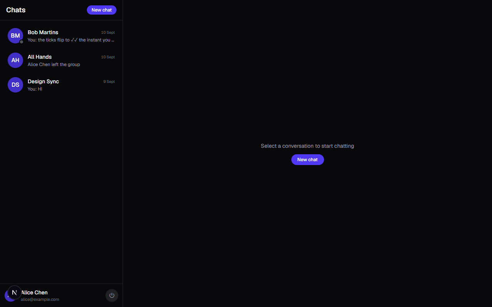 |  |
| **Inbox** — live unread badges, presence dots, active-row highlight, user footer | **Direct chat** — sender grouping, gradient bubbles, watermark ticks, typing indicator |
| 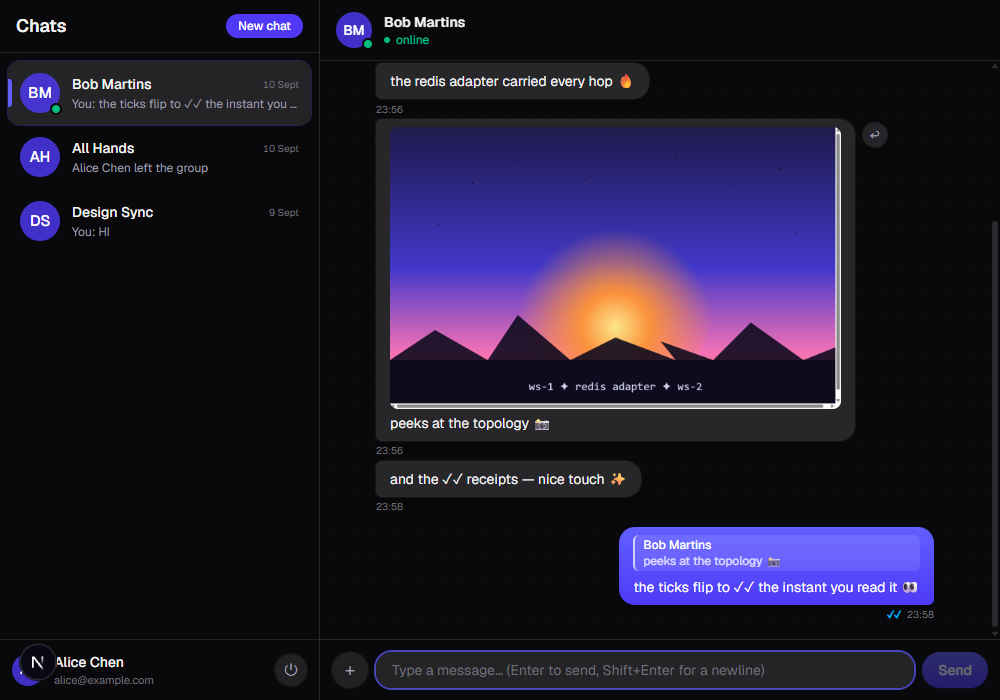 | 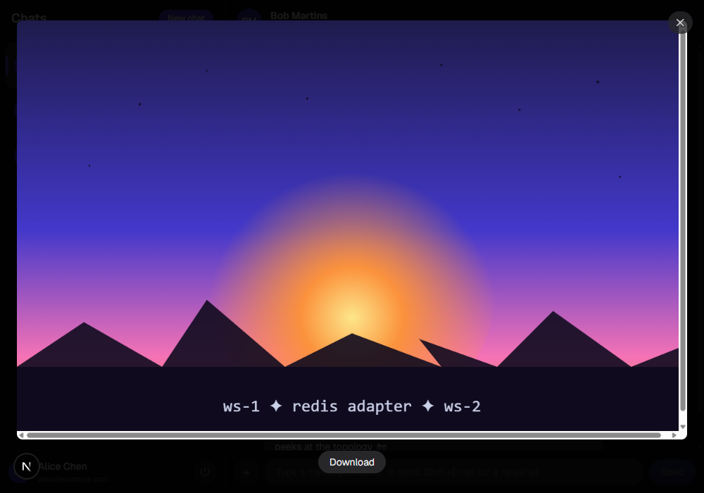 |
| **Typing indicator** — broadcast-only, 4 s client eviction | **Attachments** — inline image (signed URL), portal lightbox |
| 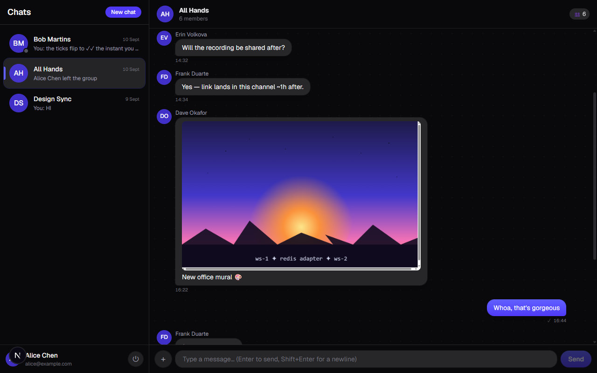 | 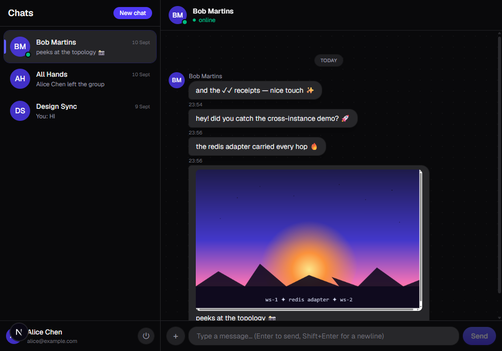 |
| **Group chat** — member avatars, SYSTEM messages, image message | **Reply** — quote preview in the composer, jump-to-original |
| 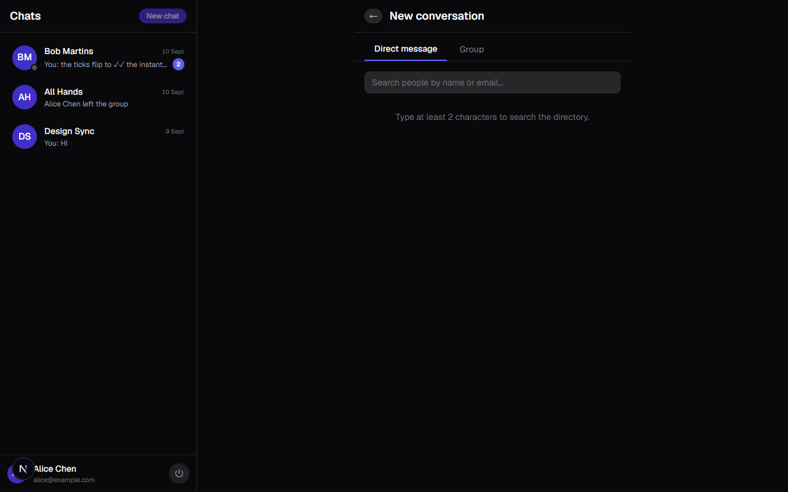 | 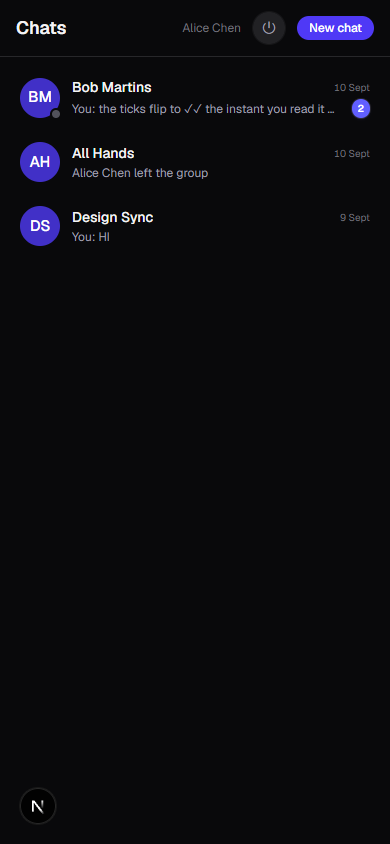 |
| **New chat** — directory search → DM, group builder | **Mobile** — full-screen list → chat swap |
| 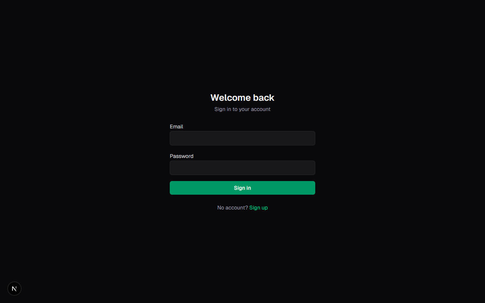 | 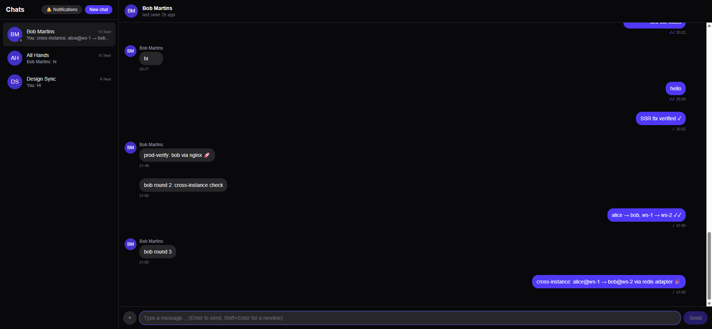 |
| **Sign in** — NextAuth credentials (JWE session) | **Capstone** — chat across two ws instances through nginx |

## Getting Started

```bash
# 1. Dev services
docker compose up -d postgres redis

# 2. Env
cp .env.example .env          # set NEXTAUTH_SECRET (openssl rand -base64 32)

# 3. Database
npm run db:migrate && npm run db:seed

# 4. Run (web :3000 + ws :4001)
npm run dev

# Sign in with a seed user (alice@example.com … frank@example.com, all Password123!)
# in two different browser windows and watch the real-time layer do its thing.
```

### The adapter-proof topology

```bash
docker compose --profile prod-verify up
# → migrate (prisma migrate deploy) → web (Next standalone) + ws-1 + ws-2 + nginx :8080
# Open http://localhost:8080 in two windows: nginx round-robins the socket.io
# connections across BOTH ws instances, and the Redis adapter makes them one
# logical cluster — chat works across instances with zero client awareness.
```

## Key Trade-offs

1. **Watermark receipts vs per-message receipts** — O(1) storage, O(members) reads, no "delivered vs read" distinction; the Slack/Discord model.
2. **Broadcast-only typing** — no Redis key, 4 s client eviction; persist-nothing design for data nobody ever queries.
3. **Keyset vs offset pagination** — stable under live appends; offset pages shuffle when messages arrive mid-scroll.
4. **Unread: Redis for push, Postgres for truth** — REST re-derives counts from the DB (`COUNT WHERE createdAt > lastReadAt`); a Redis flush self-heals on the next fetch.
5. **Socket.IO vs raw `ws`** — rooms, acks, reconnection and the adapter ecosystem for ~40 KB; raw `ws` would mean hand-rolling all four.
6. **Monorepo shared contract** — one zod file consumed by both processes; the cheapest possible defense against payload drift.

## Scaling Story

The adapter makes scale-out boring (that's the point): need more socket capacity, add `ws-3` to the compose/nginx upstream — rooms, presence, unread and typing all keep working because state lives in Redis, not in any instance's memory. Next steps if this grew: sticky sessions for locality (not correctness), message search (Postgres full-text), delivery ≠ read receipts, and moving inbox unread derivation fully behind the Redis counters with a Postgres reconciliation job.

## What I Learned

- **Rooms are routing, not authorization.** Every privileged socket handler re-checks membership in the DB — the kicked-member integration test fails within one message otherwise.
- **Atomicity at the edge matters more than code volume.** The first/last-socket bug class disappears when `SADD`+`SCARD` runs as one Lua script; two racing instances can't both claim "first".
- **A shared contract package pays for itself within days.** Every payload change breaks typecheck in both apps simultaneously.
- **Optimistic UI needs a server authority.** `clientId` (client UUID, server-unique) makes the persisted row the dedupe authority for reconnect double-sends.
- **Self-healing beats cleanup code.** TTL presence keys, fail-open rate limiting, Postgres-derived unread counts — every cache is rebuildable.